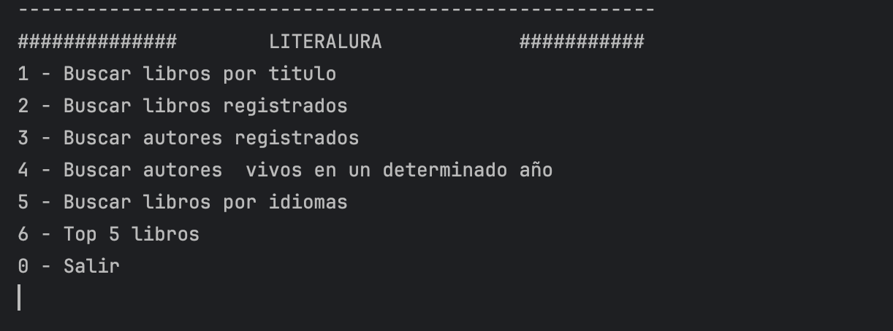

# Literalura

Literalura es un sistema de gestión de libros y autores desarrollado con Spring Boot, JPA y PostgreSQL. Este proyecto proporciona una interfaz interactiva para realizar diversas operaciones relacionadas con la gestión de una biblioteca digital, incluyendo búsqueda de libros, registro de autores, y más.

## Características

- Búsqueda de libros por título
- Listado de todos los libros registrados
- Búsqueda de autores por idioma
- Registro de nuevos libros y autores
- Busqueda de autores por año
- Obtener un top 5 de libros 

## Requisitos Previos

Asegúrate de tener instalado lo siguiente antes de comenzar:

- Java JDK 17 o superior
- Maven 3.6+
- PostgreSQL 12+
- IDE de tu preferencia (recomendado: IntelliJ IDEA o Eclipse)

## Configuración del Proyecto

1. **Clonar el Repositorio**

   ```sh
   git clone https://github.com/tu-usuario/literalura.git
   cd literalura
   ```

2. **Configurar la Base de Datos**

   - Crea una base de datos en PostgreSQL para el proyecto.
   - Actualiza el archivo `src/main/resources/application.properties` con tus credenciales de base de datos:

     ```properties
     spring.datasource.url=jdbc:postgresql://localhost/nombre_de_tu_bd
     spring.datasource.username=usuario
     spring.datasource.password=contraseña
     ```

3. **Compilar el Proyecto**

   ```sh
   mvn clean install
   ```

4. **Ejecutar la Aplicación**

   ```sh
   mvn spring-boot:run
   ```

   O ejecuta la clase principal `LiteraluraApplication` desde tu IDE.

## Uso

Una vez que la aplicación esté en ejecución, se presentará un menú interactivo en la consola. Sigue las instrucciones en pantalla para:



## Estructura del Proyecto

```
literalura/
│
├── src/main/java/com/tuempresa/literalura/
│   ├── config/         # Configuraciones de Spring
│   ├── model/          # Entidades JPA
│   ├── repository/     # Repositorios JPA
│   ├── service/        # Lógica de negocio
│   └── LiteraluraApplication.java  # Clase principal
│
├── src/main/resources/
│   └── application.properties  # Configuración de la aplicación
│
└── pom.xml  # Configuración de Maven y dependencias
```


## Contacto

yoldi carrada - yoldirgb@protonmail.com

Enlace del Proyecto: [https://github.com/tu-usuario/literalura](https://github.com/tu-usuario/literalura)
